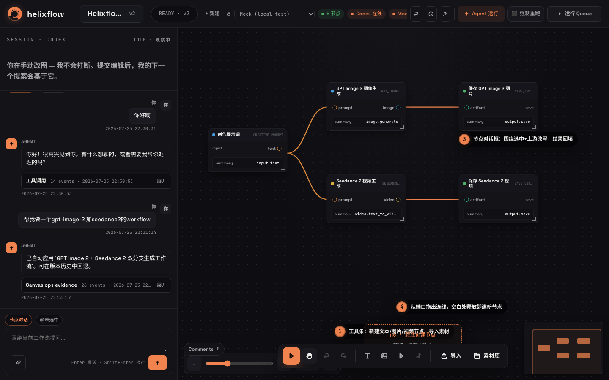

# Helixflow

**Describe what you want. Get a working AI workflow.**

Helixflow is a local-first AI workflow orchestrator: tell the Agent what to generate in plain language, and it builds and wires the node graph for you — then runs it through real model providers, retries failures within budget, and repairs the graph when you ask it to debug. You never have to hand-wire nodes; you don't even have to review the Agent's edits unless you want to.



## Why Helixflow

Most AI workflow tools make *you* wire the nodes. In Helixflow the Agent does the wiring:

- **From prompt to pipeline** — "make me a GPT Image 2 + Seedance 2 workflow" produces a wired, runnable graph in one turn. The Agent's edits are auto-applied as validated transactions; manual node editing stays available and the Agent builds on top of your changes instead of fighting them.
- **Self-healing runs** — failed runs get bounded automatic retries (`HELIXFLOW_RUN_MAX_RETRIES`), cost-gated like any other run: a retry without a cost estimate or above your budget waits for confirmation instead of spending. When a retry isn't enough, ask the Agent why the run failed and it reads the error and repairs the graph.
- **Autonomy with a seatbelt, not a leash** — every Agent edit is an immutable version, so full rollback is always one click away; and runs are cost-estimated first, so anything above your USD threshold pauses for confirmation while everything below it just runs. Trust the Agent by default, audit it when you care.
- **Local-first & fail-closed** — SQLite + local storage, binds to loopback by default, refuses to execute runs while no real provider is configured, and mock mode requires an explicit double opt-in.

The name combines "helix" and "flow": each Agent edit → run → error → fix loop spirals the result tighter.

## Quickstart

Requires Rust 1.95.0 (pinned by `rust-toolchain.toml`) and Node.js 22.

Image preprocessing uses the [bundled Cuter snapshot](web/vendor/cuter/README.md).
The frontend build does not require a separate Cuter checkout.

```sh
# 1. Build the frontend from the lockfile
cd web && npm ci && npm run build && cd ..

# 2. Real providers: set credentials only. Helixflow auto-selects atlas (then fal)
#    when HELIXFLOW_RUNTIME_PROVIDER is unset.
ATLAS_API_KEY=... cargo run --release -p helixflow-server

# Or local mock (no API key; requires both flags):
HELIXFLOW_RUNTIME_PROVIDER=mock \
HELIXFLOW_ENABLE_MOCK_PROVIDER=1 \
cargo run --release -p helixflow-server

# 3. Open http://127.0.0.1:8787/
```

Atlas and FAL credentials may coexist in the same process; each workspace can
switch between enabled providers in the workbench. Set
`HELIXFLOW_RUNTIME_PROVIDER=fal` (or `atlas`) only when you need to override the
auto-default.

Health check: `GET /api/ready` verifies database, storage, and provider.

## How it works

```
chat → Agent builds/edits the graph (atomic version commit) → cost-gated run → outputs
                     ↑                                                    |
                     └— bounded retry / Agent debug / one-click rollback ←┘
```

- **Frontend**: React 19 + TypeScript + Vite — chat pane, node canvas, version history, run dock.
- **Backend**: Rust + axum + tokio + sqlx + SQLite — `RunService` executes graph nodes through `ModelGateway` providers (Atlas, fal, mock; ComfyUI planned as an optional provider).
- **Agent**: Codex CLI first, producing validated graph transactions and run plans through a sandboxed `ctx/` / `out/` contract.

Workspace layout:

```
crates/
  server/    # HTTP/WS API, app state, routes
  store/     # SQLite persistence
  graph/     # graph model + version transactions
  registry/  # node/model registry + capability catalog data
  compiler/  # IntentPlan -> typed graph compiler
  gateway/   # ModelGateway provider abstraction
  run/       # run executor, cost gate, retries
  agent/     # Codex CLI agent runtime
web/         # React workbench
```

## Configuration

| Variable | Meaning |
|---|---|
| `HELIXFLOW_BIND_ADDR` | Listen address (default `127.0.0.1:8787`). Non-loopback requires `HELIXFLOW_AUTH_TOKEN`. |
| `HELIXFLOW_AUTH_TOKEN` | Deployment access token. CLI/API clients use `Authorization: Bearer`; browsers exchange it at `/login` for an HttpOnly, SameSite=Strict session cookie. URL query tokens are rejected. |
| `HELIXFLOW_RUNTIME_PROVIDER` | Optional override for the default provider: `atlas`, `fal`, or explicitly `mock` (dev/test). When unset, Helixflow picks the first enabled real provider (`atlas`, then `fal`); with none configured it stays on synthetic `unconfigured` (fail closed, never auto-mock). Workspaces may still switch among enabled providers. |
| `HELIXFLOW_ENABLE_MOCK_PROVIDER` | Required to actually enable the `mock` provider. |
| `HELIXFLOW_WEB_DIST` | Frontend build dir served by the backend (default `web/dist`). |
| `HELIXFLOW_DATA_DIR` | Durable data root (default `$HOME/.helixflow`; never process cwd). |
| `HELIXFLOW_DATABASE_URL` | Database URL override (default SQLite inside the data root). |
| `ATLAS_API_KEY` / `FAL_KEY` | Provider credentials. |
| `HELIXFLOW_CODEX_RUNTIME` | Agent transport: `app-server` (default, persistent Codex threads) or `exec` rollback mode. |
| `HELIXFLOW_AGENT_RUN_CONFIRMATION_THRESHOLD_USD` | Cost above which runs wait for confirmation (default 0). |
| `HELIXFLOW_RUN_MAX_RETRIES` | Max derived retry runs after a failure (`0`–`10`, default `1`). |
| `HELIXFLOW_MAX_PARALLEL_STEPS` | Concurrent execution step limit (`1`–`1024`; invalid values fail startup). |
| `HELIXFLOW_MAX_UPLOAD_BYTES` | Per-image upload limit in bytes (default 16 MiB). |

## Development

```sh
# backend + frontend dev servers (Vite proxies /api and /ws)
cargo run -p helixflow-server            # 127.0.0.1:8787
cd web && npm run dev                    # 127.0.0.1:5173

# Rust checks
cargo fmt --all -- --check
cargo check --workspace --locked
cargo clippy --workspace --all-targets --locked -- -D warnings
cargo test --workspace --all-targets --locked

# Web checks
cd web
npm ci
npm test
npm run build
npm run test:e2e                # real Chromium interactions + enforced p95 in CI
npm run test:e2e:performance    # focused 4000-node benchmark

# Release-topology startup/readiness/shutdown smoke
cd ..
./scripts/smoke-release.sh
```

The production checklist is in [`docs/OPERATIONS.md`](docs/OPERATIONS.md).
The current product contract is [`SPEC_WORKFLOW_ORCHESTRATOR_V2.zh.md`](SPEC_WORKFLOW_ORCHESTRATOR_V2.zh.md).
Historical specs and supporting design material live in
[`SPEC_WORKFLOW_ORCHESTRATOR.md`](SPEC_WORKFLOW_ORCHESTRATOR.md), [`docs/`](docs/), and [`specs/`](specs/).

## Repository policy

- Keep `main` stable; work in focused branches; one PR per issue.
- Never introduce provider secrets into the repo, logs, DB fixtures, or Agent context.

## License

See [LICENSE](LICENSE).
