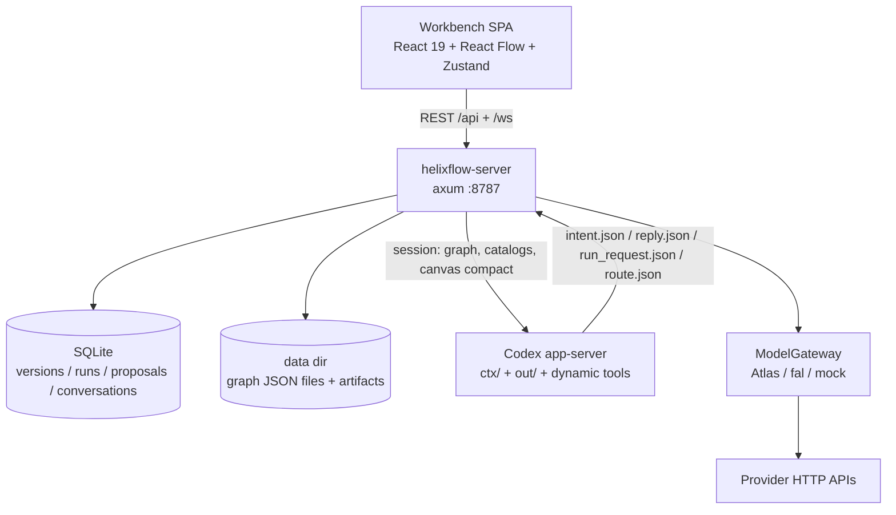
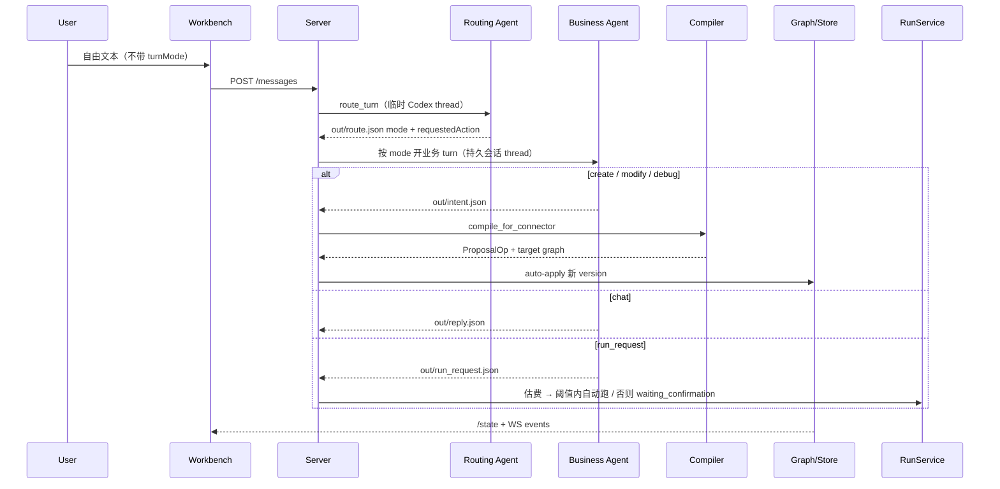
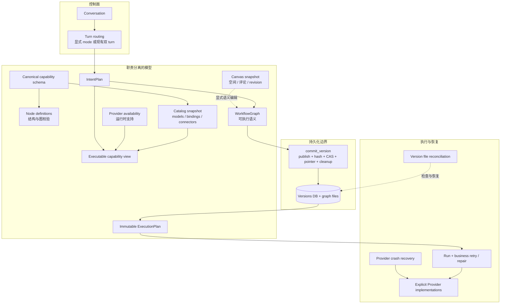

# Helixflow 架构与设计优化分析

状态：架构分析与决策记录；规范性产品合同见根目录
`SPEC_WORKFLOW_ORCHESTRATOR_V2.zh.md`。本文不是 API/实现 spec。

日期：2026-09-02

修订日期：2026-09-03（按当前边界判断收口路线）

代码基准：GitHub `origin/main` @ `b02f11bba8c7fa9dc837b21c2eb5154c3c269301`（含 PR #194 语义路由）。不包含工作区未提交改动。

对照文档：

- `SPEC_WORKFLOW_ORCHESTRATOR.md`（2026-06-12，v1 产品合同）
- `docs/AGENT_RUNTIME_PROVIDER_SPEC.md`（Agent / provider 边界）
- `docs/references/AGENT_DRIVEN_CANVAS_WORKFLOW_RESEARCH.zh.md`（2026-07-26 外部调研）
- `docs/CANVAS_BACKEND_FORMAT.zh.md`（画布 SoT 提案）
- `docs/RFC_AGENT_OWNED_TURN_ROUTING.zh.md`（已实现的入口路由）
- `docs/REACT_FLOW_CANVAS_ARCHITECTURE.zh.md`（画布渲染决策）

带「建议」「推荐」「目标形态」的段落是基于上述事实的设计判断，不表示仓库已批准改动。

本轮用户已接受本文的收口路线，当前工作树已完成对应最小实现：canonical capability
schema、durable version commit boundary、Canvas snapshot/revision、Agent 单一 Intent 合同，
以及删除未产品化的 agent-fix。本文对 `origin/main` 的事实分析仍保留为决策依据；实际
规范和验收条件以 v2 产品合同为准。

---

## 1. 结论摘要

Helixflow 已经做成了一条完整的 local-first 编排链路：自然语言进 Agent，高层 `IntentPlan` 经确定性编译落到不可变 version，RunService 通过 ModelGateway 调 Atlas / fal / mock，成本和失败路径有账本。这个判断仍然对：**Agent 管语义，后端管编译、版本、成本和执行。**

当前的主要设计债不是缺功能，而是几个关键所有权和事务边界仍然模糊。具体表现：

1. `NodeRegistry`、`CatalogSnapshot`、`ProviderCatalog` 分别描述结构节点、静态能力与 binding、运行时 provider 可用性。三者职责不同，不应物理合成，但 capability schema 与 node 定义之间仍靠手写映射同步。
2. 画布和执行图仍是同一份 `WorkflowGraph`，却另有评论、presence、磁盘 snapshot 和 `semantics_json`。`CANVAS_BACKEND_FORMAT` 写过正确分层，实现只做了半截。
3. 写 version 的入口至少七条，文件 publish、SQLite CAS、current-version 更新和清理散落在 server。这里缺的是单一 durable version commit boundary。
4. 产品合同已经从「提议后人 Apply」变成「自动 apply + 成本闸 + rollback」，v1 spec 没有升到 v2。后续 issue 会同时服务两种产品。
5. Agent 仍有 Intent 与 legacy proposal 两套图合同，自由文本还要经过路由 turn 和业务 turn。动态工具和 `out/*.json` 只是同一个 `OutputContract` 的两种提交方式，不是两套业务协议。
6. self-heal、agent-fix、provider recovery、version reconciliation 和用户 rerun 分属不同故障域。需要统一的是产品可见性、相关 ID 和预算政策，而不是把它们塞进一个持久化状态机。

不建议现在加 provider、上 ComfyUI 方言、或把关键词路由加回去。杠杆在收口：先写 v2 合同，再建立 canonical capability schema、durable version commit boundary 和最小 canvas snapshot，并决定 agent-fix 是正式产品化还是删除。通用 op log、HITL、conditional、action envelope、描述型通用 connector 和 ComfyUI 都暂缓，等待明确需求或观测证据。

---

## 2. 分析对象与方法

### 2.1 为什么用 `origin/main` 而不是本地工作区

本地 `main` 在分析当时停在 `efe923f`，比远程少 #194。工作区还有未提交的 gateway / run 文件。那些改动不能代表已发布设计。本文只读远程 `origin/main`。

### 2.2 规模快照

`origin/main` 上 Rust / TS 源码行数（含测试）：

| 层 | 角色 | 文件 | 行数 |
|---|---|---:|---:|
| `crates/server` | HTTP/WS、编排、文件一致性、协作 | 58 | 24216 |
| `crates/store` | SQLite 记录 | 40 | 14380 |
| `crates/run` | 执行、成本、恢复、修复 | 38 | 11459 |
| `web/src` | 工作台 | — | 20901 |
| `crates/agent` | Codex runtime 与输出契约 | 11 | 5288 |
| `crates/gateway` | Provider | 10 | 4252 |
| `crates/graph` | 结构图、ops、semantics | 5 | 2418 |
| `crates/registry` | 节点定义与能力目录 | 10 | 2217 |
| `crates/compiler` | Intent → 图 | 6 | 1428 |

领域内核（graph + registry + compiler）合计约 6k 行。胖的是 server、store、run 和前端 store。这是结构信号：编排和持久化在替领域层做产品决策。

### 2.3 事实 / 推断 / 建议

- **事实**：仓库里能打开的类型、路由、迁移、flag、文档原文。
- **推断**：这些结构会如何影响后续改动成本和产品心智。
- **建议**：可选的收口方案，附带否决的替代方案。

---

## 3. 当前系统结构

### 3.1 容器图



### 3.2 领域对象（实际存在的投影）

同一张「工作流」在代码里至少有这些形状：

| 投影 | 定义位置 | 职责 |
|---|---|---|
| `IntentPlan` | `crates/compiler/src/intent.rs` | Agent 高层意图：topology + stages + capability + 可选模型 |
| `WorkflowGraph` | `crates/graph/src/lib.rs` | 结构图：node_type、params、pos、edges |
| `NodeSemanticsEntry` | `crates/graph/src/semantics.rs` | 钉在节点上的 capability / implementation selection |
| `ProposalOp` | `crates/graph/src/lib.rs` | 底层图操作（add/remove/set_param/edge/move/resize/set_semantics） |
| `CompactCanvasGraph` | `crates/agent/src/canvas_ops.rs` | 给 Agent 看的摘要 |
| `CanvasDocument` | `web/src/types.ts` 与 canvas 路由 | 前端画布文档；评论走旁路 CAS |
| `ExecutionPlan` | `crates/graph/src/lib.rs` | run 创建时冻结的步骤 + resolved binding |
| 磁盘 graph 文件 | `versions.graph_path` + `graph_hash` | SQLite 不存图 JSON，只存路径和哈希 |

### 3.3 自由文本主路径



显式 UI 按钮会带 typed `turnMode`，跳过路由 turn。这是 #194 留下的正确例外。

---

## 4. 原始 spec 与当前实现对照

v1 spec（2026-06-12）选的是「workflow orchestrator，而不是薄 ComfyUI 客户端」。这条还在。变的是人和 Agent 的分工。

| 维度 | v1 spec | `origin/main` | 判断 |
|---|---|---|---|
| 改图合同 | Agent 写 proposal 文件；等人 `POST .../apply`（§4.2） | Intent 默认开（`HELIXFLOW_AGENT_INTENT_CONTRACT` 缺省为 on）；校验后自动 apply；`=0` 回到底层 `proposal.json` | 产品循环变了，flag 让两条契约并存 |
| Agent 是否执行 | 「Agent Does Not Execute」（§4.4） | 可输出 `run_request`；低于 `HELIXFLOW_AGENT_RUN_CONFIRMATION_THRESHOLD_USD`（默认 0）由后端自动开跑 | 边界仍成立：Agent 只请求执行，后端估费、决策并调用 provider |
| 画布编辑 | V1 non-goal：完整拖拽 | React Flow + `POST .../versions/ops` + layout + 评论/presence | 编辑器长出来了，数据模型仍是执行图 |
| 能力模型 | `NodeRegistry` 静态节点 | Registry + CatalogSnapshot + ProviderCatalog | 三者职责不同，但 capability 定义存在重复和手工同步 |
| 拓扑 | 通用 DAG | Intent 只允许 `linear` / `parallel` | 条件、循环、中途 HITL 进不了编译器 |
| 失败 | retry / interrupt | self-heal 重试 + agent-fix 修图（默认关）+ provider resume + 启动时文件对账 | 不同故障域均有机制，但产品可见性和关联方式不统一 |
| ComfyUI | 未来 provider，不是 v1 引擎 | `WorkflowBackendDefinition` 槽位存在，seed 为空 | 抽象占位，无实现 |
| 多用户 / 云 | 明确 non-goal | 评论 CAS 按「40 路兼容」留重试 | 单用户产品上的协作子系统 |
| 人的控制点 | 审 proposal、确认付费 run | 成本闸、version rollback、输出 accept/reject | 控制点后移，spec 未改写 |

仍应保住的原始原则：

- 后端是真相源，前端不直连 provider / Agent CLI / 本地模型文件。
- 图变更是不可变 version，run 钉在某个 version 上。
- 付费调用有成本闸和 ledger。
- Agent 不持有凭据、不写数据库。

已经被当前产品循环超越、但 spec 仍写成现行合同的：

- Propose Then Apply（等人审 diff）
- V1 不做完整手动画布

「Agent Does Not Execute」没有被放弃。它应在 v2 中写得更精确：Agent 可以提交 `run_request`，但不直接调用 provider、不持有 key、不写数据库；执行决策、成本闸和实际 dispatch 都属于后端。

这是产品身份变化，不是实现细节。不先写 v2 合同，下一条 GH 会继续同时服务「审图器」和「自动导演」。

---

## 5. 同类产品对比

2026-07 调研已经看过 tldraw Agent、tldraw Workflow、Vercel Workflow Builder、OpenSail、n8n、Dify、infinite-canvas。当时的核心判断今天仍然成立：值得抄的是 Agent 与画布之间的中间层，不是某个画布 SDK。

调研之后仓库合入了 GH130 Intent 编译、GH145 节点 semantics、React Flow、#194 语义路由。下表按 **2026-09-02 的 origin/main** 重比，不再重复 7 月那份「Agent 直接写 node id」的过时描述。

| | Helixflow | ComfyUI | n8n | Dify | tldraw Agent |
|---|---|---|---|---|---|
| 谁决定图 | Agent 出 Intent，编译器落地；人可手工 ops | 人搭节点 | AI builder + 人补凭据和参数 | 人为主，Agent 辅助 | Agent 出 typed action |
| 执行语义 | 自有 DAG + ModelGateway；plan 冻结 catalog revision | 引擎就是图 | 成熟自动化引擎 | workflow / chatflow | 宿主自定；starter 是演示执行器 |
| 能力模型 | capability × model × binding，但和 node type 双轨 | custom node = 能力 | node type = 能力 | 工具与模型目录更统一 | 节点定义较轻 |
| 人工控制 | 成本确认、rollback、输出评审 | 全程手动 | 凭据、关键参数、执行日志 | 原生 Human Input、节点试跑、trace | action 可逐条展示和控制 |
| 画布真相 | 执行图兼画布；评论旁路 | 图 JSON | 图 JSON | 图 DSL | Canvas document ≠ workflow |
| 拓扑 | Intent 仅 linear / parallel；执行器已是 ready-queue | 任意连线 + 路由节点 | 分支、循环、wait | 分支、HITL、迭代 | 由宿主图决定 |
| 强项 | 版本事务、fail-closed、成本账本、run 钉死 binding | 节点生态、本地模型 | 迭代改流、集成面 | 调试、失败路径、HITL | Agent「眼 / 手」分离干净 |
| 弱项 | 模型所有权模糊、version 提交分散、恢复动作不易观察 | 几乎无 Agent 合同 | 不是媒体管线 | 节点体系更重 | 不能当执行引擎 |

Helixflow 不该去拼 ComfyUI 节点数量，也不该去拼 n8n 的 SaaS 集成。它能赢的位置仍是调研里那条链：

```text
用户意图
  → 缺失信息检查 / 澄清
  → 能力解析（model / provider / capability / typed ports）
  → 高层 Agent action
  → 确定性编译为 graph ops
  → 类型检查、lint、layout
  → 版本事务
  → 成本闸
  → 执行与产物
```

和 tldraw / Vercel AI SDK 的差距现在不在「要不要让模型选工具」，而在 **调用次数和契约层数**。他们是一次调用选工具，宿主校验执行。Helixflow 自由文本是：先一次路由 turn 只为选封闭枚举，再一次业务 turn 才提交 Intent。RFC §7.3 自己写了这是权宜之计。

OpenSail 的「One canvas. One config. Two authors」对应到 Helixflow，意思是人、Agent、导入和修复最终必须进入同一个 durable version commit boundary。上游可以分别产生 ops、Intent 编译结果、migration snapshot 或 restore snapshot，不需要伪装成同一种操作。

Dify 展示了节点试跑、Human Input 和失败路径可以怎样产品化，但这只能作为未来能力参照。Helixflow 当前没有足够用户故事证明必须立即引入图中 HITL 或 conditional。

---

## 6. 调研差距的闭合情况

`AGENT_DRIVEN_CANVAS_WORKFLOW_RESEARCH.zh.md` §HelixFlow 当前差距 里的条目，按现在的代码重判：

| 2026-07 差距 | 2026-09 origin/main | 状态 |
|---|---|---|
| Agent 直接写 node id、edge、坐标、完整 proposal | 图编辑默认 `IntentPlan`；编译器生成 id / edge / layout | 已关闭（遗留 proposal 路径仍在） |
| 模型只能写进 title，gateway 用默认模型 | 节点 `semantics` + binding；run 冻结 `ResolvedStepBinding` | 主路径已关闭 |
| 关键词 / 空图 fallback 猜 turn mode | #194 改为模型路由；失败不回退 Chat | 已关闭 |
| 自研 DOM 画布无裁剪 | React Flow + 视口预算 | 渲染层已换；数据模型未换 |
| 语义图与 layout 应分离 | layout 仍是 `WorkflowGraph.pos`，save layout 写新 version | 未关闭 |
| 需要 conditional 等显式拓扑 | `TopologyIntent` 仍只有 linear / parallel | 能力仍无，但当前需求尚未证实 |
| 声明与执行不一致 | 新 capability 仍需同步 catalog、node definition、compiler 和 provider；当前无 node type 的 capability 也没有 enabled binding | 主路径未复发，但存在潜在同步风险（见 §7.1） |

---

## 7. 设计问题

### 7.1 三类目录的职责与同步风险

**事实**

三类对象不是三份同类真相源：

- `NodeRegistry` 定义结构节点、端口、参数和图校验。
- `CatalogSnapshot` 定义 capability、model、binding、connector 等静态解析合同。
- `ProviderCatalog` 描述运行时 provider 实际支持的操作、产物类型和 MIME。

可执行节点来自 `NodeRegistry::builtin()`。能力目录来自 `builtin_catalog()`。两者之间仍由 `crates/compiler/src/graph_builder.rs` 的 `node_type_for` 手写映射 capability 和 node type。

`image_edit`、`video_extend`、`upscale_image`、`upscale_video`、`image_analyze` 没有 node type 映射，但当前也没有 enabled binding。编译顺序是先 resolver、后 graph builder，因此它们在当前配置下先得到结构化的 `BINDING_NOT_FOUND` 澄清，不会直接走到 `UnmappedCapability`。

app-server 提供给 `canvas.submit_intent` 的 capability 枚举来自 `node_defs/catalog.json`，即当前可执行节点，并不是把九个 capability 无差别暴露给 Agent。因此这里是潜在的新增能力同步风险，不是已经发生的「目录宣称可执行、Agent 选择后硬失败」。

HTTP 仍有 `GET /api/registry/catalog` 与 `GET /api/catalog` 等不同投影；Agent `ctx/` 也分别写入 node、model、workflow backend、runtime provider、api connector 的 catalog。分投影本身不是错误，问题是共同字段没有规范性来源。

在已有 capability 下新增 model binding 不需要修改 compiler match；新增 capability 才要同步 registry、compiler 和 provider。catalog 仍由 `catalog_seed.rs` 编译进二进制，所以两类变更目前都需要发版，但故障方向不同。

**影响**

新增 capability 的声明分布在多个边界，人工漏同步后才可能形成声明—执行鸿沟。把三类目录物理合并会反过来混淆静态业务合同与运行时可用性，也不能消除结构节点和 provider 操作的差异。

**方案对比**

| 方案 | 做法 | 优点 | 缺点 | 结论 |
|---|---|---|---|---|
| A. canonical capability schema（推荐） | 一份规范性 schema 定义 capability 的输入、输出和可绑定语义；NodeDefinition 从它派生或直接引用；provider catalog 只报告运行时 availability | 删除手写 `node_type_for`；共同字段只有一个来源；保留三类对象的正确职责 | 需要先明确结构角色节点与可执行 capability 的边界 | 采用 |
| B. 只生成映射表 | seed 同时生成 NodeDefinition 和映射，禁止手写 match | 改动较小 | 重复模型仍然存在，只是自动同步 | 可作为实施切片，不是终态 |
| C. 物理合并成一个 catalog | 节点、静态 binding、运行时可用性共用一个对象 | 表面入口少 | 生命周期和所有权混在一起，测试与缓存边界变差 | 否决 |
| D. 继续人工同步 | 每次新增 capability 改多处 | 无迁移 | 潜在 gap 保留 | 否决 |

**目标形态**：用户和 Agent 只谈 capability 和 model；结构节点、静态解析合同、运行时可用性保持独立投影，但从同一 capability schema 派生或校验。只有存在可解析 binding 且运行时可用的 capability 才应被呈现为当前可执行。

---

### 7.2 画布文档与执行图未分层

**事实**

`docs/CANVAS_BACKEND_FORMAT.zh.md` 结论：SoT 不应继续只用 `WorkflowGraph`；它进一步建议 `CanvasDocument` snapshot + `CanvasOpEnvelope`。前半段分层判断成立，但通用 op log 不是当前需求的必然结果。

实现：

- `versions` 表存 `graph_path`、`graph_hash`、后来的 `semantics_json`，不存图本体。
- 图本体是 data dir 里的 JSON 文件。启动时 `reconcile_version_files`。
- 评论走 `canvas_collaboration` 的 CAS（`MAX_COMPATIBILITY_CAS_RETRIES = 64`，注释写 40 路兼容）。
- presence 是短期状态。
- 前端 store 已有 `canvas: CanvasDocument`，节点移动/连线仍转成 manual proposal ops。
- layout save 把新坐标写成一次 version。

**影响**

移动节点对执行语义过重（不可变 version + 文件 publish/commit）。但这不等于当前必须补一套事件系统：local-first、单进程、尚无正式多用户目标时，snapshot + 乐观 revision 已能解决空间状态持久化。server 的文件一致性与 reconciliation 属于 executable version 的存储问题，也不应由 canvas op log 代替。

**方案对比**

| 方案 | 做法 | 优点 | 缺点 | 结论 |
|---|---|---|---|---|
| A. 最小 Canvas snapshot + 执行投影（推荐） | 位置、尺寸、评论和画布元数据进入带 revision 的 snapshot；presence 保持临时；可运行快照仍是 version 里的 WorkflowGraph | 直接解决 layout 生成执行 version；不引入新的事件系统 | 语义编辑仍需显式投影或编译成执行图 | 采用 |
| B. 继续让 WorkflowGraph 当画布 | 把评论/presence 继续焊在 workspace 旁路 | 短期少迁移 | 文件双写和 version 膨胀继续 | 否决作为终态 |
| C. 通用 CanvasOpEnvelope / CRDT | 保存并重放所有画布操作 | 支持审计、多端离线合并和实时协作 | 当前没有对应需求，会新增事件存储、压缩和合并规则 | 暂缓，出现真实需求再评估 |

React Flow 只当视图，这条已经做对（见 `REACT_FLOW_CANVAS_ARCHITECTURE.zh.md`）。不要再把 React Flow 提升为真相源，也不要把 `CANVAS_BACKEND_FORMAT` 中尚未验证的 op log 当成已批准终态。

---

### 7.3 图写入口过多

**事实**

能产生新 version 或新 graph 文件的路径包括：

| 入口 | 路由或调用 | CandidateKind / source |
|---|---|---|
| 创建工作区 | `workspace_routes` | Initial / 视实现 |
| 手工 ops | `POST .../versions/ops` | Ops / Manual |
| layout | `POST .../versions/layout` | Layout |
| 人工 apply proposal | `POST .../proposals/{id}/apply` | ProposalApplied |
| Agent auto-apply | `workbench_message_proposals` | ProposalOps + Preview + Applied |
| restore / undo | version routes | Restore |
| schema migration | `POST .../migration/apply` | Migration |

`VersionSource` 只有 `manual | proposal | restore | migration`。layout 和 ops 都挤在 manual 里。`GraphService` 负责校验和 apply_ops，持久化合同散落在 server。

**影响**

修「提交 version 时语义层怎么写」要改多处。编译器、手工编辑、run-fix、migration 很容易各写各的 `semantics_json`。统一边界不能只抽象 `apply_ops`：restore 可以直接复用目标 graph snapshot，initial 和 migration 也不天然是 ops。

**方案对比**

| 方案 | 做法 | 优点 | 缺点 | 结论 |
|---|---|---|---|---|
| A. 单一 durable `commit_version`（推荐） | 接收 base、graph snapshot、semantics、source；内部统一文件 publish、hash、SQLite CAS、current pointer、cleanup 及现有必要关联写入 | 所有 version 都遵守同一持久化原子性；上游仍可用最自然的输入 | 需要搬出 server 中分散的 Candidate 逻辑 | 采用 |
| B. 所有入口改成 `apply_ops` | restore、initial、migration 也先制造 ops | API 名字统一 | 扭曲领域语义，还可能产生无意义 diff | 否决 |
| C. 按入口继续提交 | 现状 | 局部改动小 | 一致性继续依赖每个调用方和事后 reconciliation | 否决作为终态 |

`GraphService::apply_ops` 仍可作为「从 base + ops 得到 graph snapshot」的纯领域操作。统一的是 durable version 提交，不是所有上游输入。

---

### 7.4 修复、恢复和对账属于不同故障域

**事实**

| 机制 | 文件 | 行为 | 默认 |
|---|---|---|---|
| self-heal | `crates/run/src/self_heal.rs` | 失败后派生 retry run，同 plan 再跑 | `HELIXFLOW_RUN_MAX_RETRIES`，默认 1 |
| agent-fix | `crates/run/src/agent_fix.rs` + store run_fix_* | Agent 改图再跑，独立 attempt 链 | **默认关** `HELIXFLOW_RUN_AGENT_FIX_ENABLED` |
| provider recovery | `provider_recovery.rs` | 远程 Accepted 任务 resume / cancel | 启动时 `recover_after_restart` |
| 文件 reconciliation | `version_file_reconciliation.rs` | 磁盘图与 DB 指针对账 | 每次 `AppState::open` |
| 用户 rerun | reject output `rerun: true`、debug turn、sweep | 产品可见的再跑 | 视操作 |

self-heal 与成本闸共用 `run_requires_confirmation`，这一点是对的，避免两条预算逻辑。provider recovery 还负责重启后的 terminalization、artifact journal 等基础设施工作；version reconciliation 则检查 SQLite 指针和磁盘文件的存储完整性。它们不是业务 retry 的不同名字。

**影响**

失败之后用户不容易看出系统正在原图重跑、修改 graph 后另开 run，还是继续轮询已经 dispatch 的远端任务。这里需要统一观测和产品文案，但如果共享 attempt 上限或持久化状态机，反而可能让进程恢复受业务 retry 预算限制。

agent-fix 默认关闭却保留完整表和 worker，属于未完成的产品决定。调试 turn 可以成为显式触发 repair 的入口，但不应据此吞并 provider recovery 或 version reconciliation。

**方案对比**

| 方案 | 做法 | 优点 | 缺点 | 结论 |
|---|---|---|---|---|
| A. 按故障域保留机制，统一观测（推荐） | retry 与 agent repair 使用相关 ID、预算政策和明确状态；provider recovery 与 version reconciliation 保持基础设施边界 | 用户能理解当前动作，同时不混淆生命周期和上限 | UI/API 需要聚合多个来源 | 采用 |
| B. 所有机制合成 `retry / repair / resume` 状态机 | 共用表、attempt 上限和状态迁移 | 表面模型统一 | 把业务失败、进程崩溃和存储损坏混为一谈 | 否决 |
| C. 产品化 agent-fix | 明确触发、成本确认、version/run 关联和 UI 状态 | 保留自动修图能力 | 需要完整产品设计与验证 | 有近期用户故事时采用 |
| D. 删除 agent-fix | 删除默认关闭的表、worker 和分支 | 直接降低复杂度 | 放弃未产品化投入 | 无近期计划时采用，优于长期半关闭 |

---

### 7.5 Agent 协议层数

**事实**

历史上的文件契约（`ctx/` / `out/`）是给 Codex CLI 沙箱用的。现在生产 runtime 是 app-server，并有动态工具：`canvas.get_state`、`canvas.submit_intent`、`canvas.request_run` 等。动态工具最终仍通过 `capture_json_output` 写入同一个 `intent.json`、`reply.json`、`run_request.json` 或 `route.json` 并进入同一后端校验。

同时存在：

- `OutputContract`：`reply.json` / `proposal.json` / `intent.json` / `run_request.json`，#194 后还有 `route.json`
- `TurnMode`：chat / create / modify / debug / run
- `AgentSkill`：上述再加孤立的 `Sweep`
- `use_intent_contract` flag：测试默认 false，生产默认 true
- 路由 turn：临时 thread，无副作用；业务 turn：持久 thread

RFC 明确：不让路由污染会话；失败不静默降级。这些约束是对的。RFC §7.3 也明确：本期不合并成一个万能 action turn，以免重写 durable turn。

**影响**

自由文本延迟至少两轮模型。prompt、观测表 `agent_contract_observations`、server 分支都要覆盖 Intent 和 legacy Proposal 两套图合同。`Sweep` skill 没有对应 TurnMode，属于遗留枚举。动态工具和直接写 `out/*.json` 只是同一 `OutputContract` 的两种传输方式，不应被当作两套业务协议清理。

**方案对比**

| 方案 | 做法 | 优点 | 缺点 | 结论 |
|---|---|---|---|---|
| A. 保留双 turn，删 legacy proposal 合同（近端推荐） | 路由仍两段；Agent 图编辑只走 Intent；手工 ops 不经过 Agent 输出合同 | 立刻删除真正重复的图语义 | 延迟仍在 | 作为 v2 合同的第一步 |
| B. 统一 action envelope | 一次调用：clarify / submit_intent / submit_reply / request_run | 可能省一轮 | 要重做 durable turn、错误归属和观测 | 暂缓；只有延迟观测证明必要时再立项 |
| C. 恢复关键词分类 | 省路由 turn | 延迟低 | #194 已证明会误路由 | 否决 |

不要在阶段性收口中删除动态工具或文件传输层；只删除重复业务语义。也不要在有延迟证据前把 action envelope 当成必做的架构终态。

---

### 7.6 conditional 与 HITL 尚缺产品证据

**事实**

```rust
pub enum TopologyIntent {
    Linear,
    Parallel,
}
```

linear 要求阶段 N 只消费 N-1，且只有一个 sink。执行器已经按依赖计数 + semaphore 跑 ready-queue（GH63），能力强于 Intent 所能表达的。

成本闸只发生在 run 开始前。图中间没有「停下来问人」。`output.save` 用 `PortType::Json` 吃任意 artifact，是结构补丁不是控制流。

**影响**

执行器的表达能力大于 Intent 是事实，但不能据此推导产品现在就需要 conditional、loop 或图中 HITL。实施前至少要有具体用户故事，并回答：条件由谁计算、表达式允许什么、gate 如何持久化和恢复、输入变化后是否重新估费、分支 artifact 与 ledger 如何记录。

**方案对比**

| 方案 | 做法 | 优点 | 缺点 | 结论 |
|---|---|---|---|---|
| A. 保持当前 topology（当前推荐） | 先完成合同和数据边界收口 | 不为未验证能力增加表达式、持久化和恢复协议 | 暂时无法把审核点固化在图里 | 采用，直到出现明确用户故事 |
| B. 为具体故事单独设计 conditional / gate RFC | 先定义语义、恢复、成本和审计，再扩展 Intent | 需求与机制可验证 | 不是本次架构收口的一部分 | 需求成立后评估 |
| C. 直接上 ComfyUI 图方言 | 条件与循环交给 Comfy | 生态 | 引入第二种图语义，不能替代产品合同 | 否决为当前路线 |

---

### 7.7 server 厨房水槽

**事实**

`AppState` 持有：EventBus、Agent、sessions dir、Store、data dir、ProviderRegistry、RunService、run queue locks、active turns、reconciliation report、intent flag、migration flag、contract attribution。

`workbench_message*` 在 HTTP 层编排：开 turn、写 observation、调 compiler、auto-apply、落消息、run-fix worker。

`helixflow-compiler` 1.4k 行，却是最值钱的确定性层。server 24k 行在做产品决策。

Agent crate 的 `read_validated_proposal` 会 `GraphService::new(NodeRegistry::builtin()).preview_proposal(...)`，校验用的 registry 与运行时 catalog 不是注入进来的同一快照。

**影响**

改 Intent 应用策略要同时碰 server、agent、store、observation。测试不得不在 server 里堆 `workbench_message_tests.rs`（origin/main 上超过 1400 行）。

**方案对比**

| 方案 | 做法 | 优点 | 缺点 | 结论 |
|---|---|---|---|---|
| A. 随 durable commit 垂直收口（推荐） | 只把 version 持久化原子性移到明确边界；HTTP 保留输入解析、DTO 与 WS | 直接解决当前问题，不发动 crate 搬家 | server 其余编排仍然较重 | 当前采用 |
| B. 全面搬出 apply / compile / run-fix | 一次重排 server、graph、compiler、run 依赖 | 目标边界整齐 | 改动面大，且 agent-fix 去留尚未决定 | 暂缓 |
| C. 新增 `helixflow-app` crate | 新建应用编排层 | 依赖方向可能更清晰 | 新抽象层尚无必要 | 否决为当前路线 |

---

### 7.8 静态 seed 限制分发，但通用 connector 仍然过早

**事实**

`AGENT_RUNTIME_PROVIDER_SPEC.md`：Atlas 不得成为产品边界；runtime_provider 与 api_connector 分离。

实现：`ProviderRegistry::from_env` 注册 atlas / fal / 可选 mock / unconfigured。`catalog_seed` 写死模型和 binding。Atlas 与 fal 各约 700+ 行，队列、轮询、取消同构。`workflow_backends` 在 seed 里是空 `Vec`。

M0 计划提过 OpenAI-compat 通用连接器，`origin/main` 没有这条路径。

**影响**

在现有 capability 下加一个模型仍要改 Rust seed 并发版；有 provider 特性差异时还要改实现。Atlas 与 fal 的队列、轮询、取消存在可抽取的共性，但一个描述型通用 connector 会迅速变成包含 auth、payload 模板、轮询、取消、错误分类、SSRF 防护和 secret 注入的 provider DSL。当前只有两家实现，证据不足以证明这套 DSL 的稳定边界。

**方案对比**

| 方案 | 做法 | 优点 | 缺点 | 结论 |
|---|---|---|---|---|
| A. 当前不改 provider 架构（推荐） | 先完成合同、capability、version 与 canvas 收口 | 避免并行扩大边界 | Atlas / fal 的局部重复继续存在 | 当前采用 |
| B. 描述型 HTTP connector + 数据目录 | 配置 auth、operation、poll/cancel 和错误映射 | 成熟后可减少 provider 样板 | 安全与错误语义复杂；两家样本不足 | 暂缓；第三个真正同构 connector 出现后再决定 |
| C. 抽共享 HTTP / polling / error 组件 | 保持显式 Provider impl，只复用已验证的机制 | 去除真实重复，不提前发明配置语言 | 当前路线没有新增 provider 需求 | 下次实际修改 provider 时评估 |
| D. 先做 ComfyUI backend | 占 workflow_backend 槽 | 增加生态入口 | 再引入一套图方言和运行语义 | 否决为当前优先级 |

---

### 7.9 前端上帝 store

**事实**

`web/src/store.ts` 约 870 行。`WorkbenchStore` 同时管：bootstrap、canvas document、presence、chat、run、provider、manual edit session、proposal apply/dismiss、version undo/restore、layout、输出评审。

已拆出 `store-events`、`store-model`、`workbench-edit-session`、`workspace-snapshot`。React Flow 适配器按文档是受控投影，这点正确。

**影响**

后端若拆 canvas / graph / run，前端仍会把 `/state` 整包当唯一原子，再焊回去。

**建议**：不要先做前端 store 大重构。阶段 3 只把 canvas snapshot 与 executable graph version 的读写边界拆开，并修改受影响的最小 store slice；conversation、run 和订阅结构保持不动。

---

## 8. 建议的目标结构



原则：

1. Agent 只产生 Intent 或澄清，不产生 node id / 坐标 / binding id。
2. canonical capability schema 是共同业务字段的规范来源；NodeRegistry、CatalogSnapshot、ProviderCatalog 保持各自职责。
3. Canvas snapshot 保存空间与评论；只有执行语义改变时才生成新的 WorkflowGraph 并提交 version。
4. `commit_version` 是唯一 durable version 持久化边界；`apply_ops`、Intent 编译、migration 和 restore 都可以是它的上游。
5. retry / agent repair 共享清晰的预算政策和关联 ID；provider recovery 与 version reconciliation 保持独立。
6. 人的控制点是成本阈值、rollback 和输出取舍。不默认审每一条 Agent diff，也不在没有需求时预设图中 gate。

这不是「单一 IR」。Intent、Canvas、WorkflowGraph、ExecutionPlan 和 catalog 的所有权、生命周期与稳定性不同；目标是单向转换和明确边界，不是把它们合成一种模型。

---

## 9. 分阶段路线与本轮落地状态

顺序有依赖。先固定产品合同和共同 schema，再移动持久化边界；不要用未来功能推动当前重构。本轮按该顺序完成了阶段 0–4 的最小切片。

### 阶段 0 — v2 产品合同（文档）

已在 `SPEC_WORKFLOW_ORCHESTRATOR_V2.zh.md` 写清并归档，v1 spec 标记为历史合同：

- Agent 自动 apply 已校验 Intent。
- 人默认不审底层 ops；rollback 和成本闸是安全带。
- Intent 是 Agent 唯一写图合同；删除 Agent legacy `proposal.json`。编译器内部和手工编辑可以继续使用 graph ops，但它们不是 Agent 输出合同。
- 「Agent Does Not Execute」继续成立：Agent 只提交执行请求，后端拥有凭据、成本决策和 provider dispatch。
- 明确 TurnMode 与 Skill 的关系，删除或产品化 Sweep。

验收：README、AGENT spec、v1 spec 不再互相打架。可以用「一份用户故事」走完：说话 → 图出现 → 低于阈值自动跑 → 失败可见是 retry 还是等确认。

### 阶段 1 — canonical capability schema

- 用表格列出 capability ↔ 现有 node type ↔ connector operation，并标出 enabled binding 与运行时 availability。
- 定义 capability 的规范性输入/输出和可绑定语义；由它派生 NodeDefinition 或让节点直接引用它。
- 删除 `node_type_for` 手写 match。保留 registry、catalog、provider availability 的独立投影，不做物理大对象合并。

验收：每条 enabled binding 都能在 mock 可用性下得到 Compiled 或结构化 Clarify；新增 capability 不需要手写 compiler 映射；在已有 capability 下新增模型不改 compiler。

### 阶段 2 — durable version commit boundary

- 建立唯一 `commit_version(base, graph_snapshot, semantics, source)` 概念边界；当前确实需要与 version 同事务写入的关联记录也在该边界内完成，不预先设计通用 side-effect 框架。
- 文件 publish、hash、SQLite CAS、current-version 更新和 cleanup 进入该边界，server 路由变薄。
- ops、Intent、initial、restore、migration 各自生成合适的 graph snapshot，不强制转换成 ops。

验收：手工连线、Agent Intent、restore、migration 都通过同一个 durable commit；一致性测试覆盖该边界。启动 reconciliation 保留为异常检测与恢复机制，不再补偿普通写入路径的分歧。

### 阶段 3 — 画布与执行投影

落地 `CANVAS_BACKEND_FORMAT` 的最小子集：节点位置、尺寸、评论和画布元数据进入 snapshot + revision；presence 保持临时；snapshot 成为空间状态的权威来源，执行图中的 `pos/size` 只保留为新节点与首次投影的布局 seed。产物仍走 artifact，不进入 canvas snapshot。暂不引入通用 op log。

验收：纯移动节点不增加可运行 version idx（或明确记为 canvas-only revision）。刷新后位置仍在。Queue / 成本闸行为不变。

### 阶段 4 — agent-fix 产品决策与恢复可见性

- 本轮选择删除 agent-fix；保留显式 Debug Workflow、self-heal、provider recovery 和 version reconciliation。
- 若产品化，明确 agent repair 的触发、成本、version/run 关联和 UI 状态，并与 retry 共享预算政策。
- provider recovery 与 version reconciliation 继续保持独立故障域，但 UI/API 应准确展示当前动作。

验收：账本能回答业务 retry / repair 是第几次、是否再次扣费；重启恢复不会被业务 attempt 上限阻断；用户能区分 retry、repair 和远端 resume。

### 后续候选，不进入当前实施路线

- action envelope：只有观测证明双调用延迟不可接受时再做。
- conditional / HITL：只有具体用户故事定义了条件、恢复、成本和审计语义时再做。
- 通用 canvas op log：只有多端离线合并、审计回放或实时协作成为需求时再做。
- 描述型 HTTP connector：先抽两家 provider 的真实公共组件，第三个同构实现出现后再判断。
- ComfyUI：不属于当前架构收口路线。

---

## 10. 成功度量

这些是设计收口是否有效的度量，不是性能口号。基线需要在阶段 0 后采一次。

| 度量 | 当前（定性） | 目标 | 量法 |
|---|---|---|---|
| Agent 图契约份数 | Intent + 遗留 proposal | 1（Intent） | 代码：`OutputContract` 图相关变体；生产 flag 默认且测试不再走 proposal 主路径 |
| 编译硬编码映射 | `node_type_for` match 4 条，catalog capability 9 条 | 0 处手写 map；enabled binding 可编译或结构化澄清 | 单测：对 enabled binding 全量 resolve + compile |
| 写 version 的独立实现 | ≥7 个路由/模块拼 CandidateKind | 1 个 durable `commit_version` | `VersionFileCandidate::from_graph` 等 publish/commit 原语只有该边界调用 |
| 自由文本模型调用 | 路由 + 业务 = 2 | 当前维持显式按钮 1、自由文本 2；采集数据决定是否另立 envelope RFC | 观测表 / 日志中的 Codex turn 数与延迟 |
| 业务修复可见性 | self-heal + 默认关闭的 agent-fix + 用户 rerun | retry / repair 有相关 ID、attempt 与成本状态 | store + API + UI 状态 |
| 基础设施恢复 | provider recovery + version reconciliation | 独立于业务 attempt，状态可观察 | 重启与文件故障测试 |
| capability 共同字段 | registry / catalog / provider 分散描述 | 一份 canonical schema，三种职责投影 | schema 派生与一致性测试 |
| spec 一致性 | v1 §4.2 与 README 自动 apply 冲突 | 一份 v2 合同被 README 引用 | 文档审查 |

---

## 11. 风险

| 风险 | 严重度 | 可能 | 缓解 |
|---|---|---|---|
| 引入 canonical schema 时 graph 与 catalog 投影不一致 | 高 | 中 | 先写全量对照表与派生测试，再删除手写映射；是否需要迁移由实施 RFC 基于当前数据决定 |
| 取消 proposal 合同导致手工 ops 误伤 | 高 | 低 | 手工 ops 从未走 Agent 文件；只删 Agent 的 `proposal.json` |
| 统一 commit_version 时文件 CAS 回归 | 高 | 中 | 先搬持久化算法不改语义；保留现有 consistency 测试 |
| 画布分层后面板选中/连线错位 | 中 | 中 | React Flow 仍受控于执行投影；canvas-only 字段单独测 |
| 错把 provider recovery 并入业务 retry，导致重启恢复受 attempt 限制 | 高 | 中 | 保持故障域和持久化状态独立，只统一观测与关联字段 |
| 过早做 action envelope、op log、HITL 或通用 connector | 中 | 高 | 不进入当前路线；分别要求延迟、协作、用户故事或第三实现证据 |
| 把本文当成规范性 spec | 中 | 高 | 文首状态已声明；实现与验收以 v2 产品合同为准 |

---

## 12. 明确不在当前范围

- 工作区未提交的 Atlas / artifact / settlement 改动。
- 再加一家 provider 或 ComfyUI 图方言。
- 把 #194 的模型路由退回关键词表。
- 多用户账号、云托管、公开远程访问（v1 non-goal 仍然成立）。
- 为满足文件行数限制去切 `run` / `store` 的记录模块。那是 7.7 的症状。
- 评测外部产品真实生成成本或 Helixflow 线上性能。本文是结构分析。

---

## 13. 相关文档怎么读

| 文档 | 和本文的关系 |
|---|---|
| `SPEC_WORKFLOW_ORCHESTRATOR.md` | v1 合同；§4.2 已被实现超越，§4.4 的安全边界仍成立但需在 v2 澄清 |
| `docs/AGENT_RUNTIME_PROVIDER_SPEC.md` | 分层词汇（workflow_backend / runtime_provider / api_connector）仍应用；实现未赶上 |
| `docs/references/AGENT_DRIVEN_CANVAS_WORKFLOW_RESEARCH.zh.md` | 外部事实与中间层判断；§当前差距需按本文 §6 修正 |
| `docs/CANVAS_BACKEND_FORMAT.zh.md` | 阶段 3 的分层依据；当前只采用最小 snapshot，不预先采用通用 op envelope |
| `docs/RFC_AGENT_OWNED_TURN_ROUTING.zh.md` | 当前入口设计；其 §7.3 说明 action envelope 为什么不是近期范围 |
| `docs/REACT_FLOW_CANVAS_ARCHITECTURE.zh.md` | 渲染决策，保持；不改变后端 SoT |
| `docs/ROADMAP.md` | M0–M3 里程碑偏功能清单；与本文的「收口顺序」不是同一条轴 |

本轮收口完成后，下一步只应根据真实使用证据选择新课题；action envelope、conditional/HITL、通用 op log、描述型 connector 和 ComfyUI 仍不属于当前合同。
