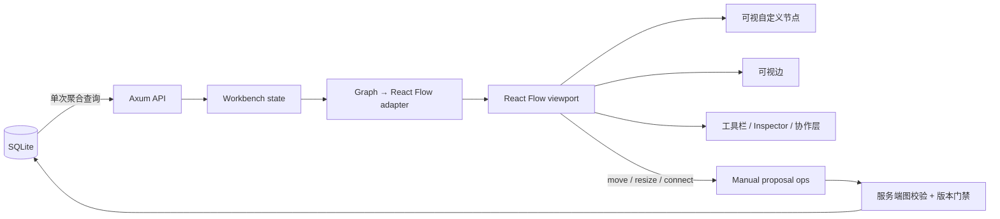

# Helixflow React Flow 画布重构规格

**状态**：核心迁移完成；持续性能门禁待接入 CI

**创建日期**：2026-08-28

**参考产品**：[TapNow Canvas](https://app.tapnow.ai/canvas/9713d097-574f-4ce3-ab6a-ef231026c3ef)

**决策范围**：画布渲染与交互、工作区列表摘要查询；不改变运行成本确认、版本历史、回滚和服务端图校验。

## 1. 问题

当前画布用 React DOM 节点、单个 SVG 边层和自研平移/缩放/框选/连线控制器实现。它会把全部节点和边挂载到 DOM，没有视口裁剪，也没有可复现的 4000 节点性能基准。代码同时维护多套坐标转换和拖拽状态，交互复杂度已经超过自研方案带来的收益。

工作区列表还会先查全部工作区，再为每个工作区分别查询用户消息数和第一条消息。4000 个工作区对应 8001 次 SQL，而摘要完全可以在一次聚合查询中得到。

## 2. 参考页面实测

2026-08-28 在登录态 Chrome 中检查目标 TapNow 页面，得到以下事实：

- 页面使用 React Flow：DOM 中存在 `.react-flow`、`.react-flow__viewport`、`.react-flow__node-*`、Handle，以及 React Flow attribution。
- 画布为黑色点阵背景，左侧胶囊工具栏、左下视图控制、顶部项目操作和右侧固定 Agent 面板均为自定义 UI，并非 React Flow 默认 Controls 或 MiniMap。
- 样例包含 23 个节点、18 条边；当时只有 4 个节点进入视口，但 23 个节点仍全部挂载。因此参考页面证明了技术选型和交互结构，不能证明 4000 节点性能。
- 参考截图保存在 `artifacts/ui-design/tapnow-react-flow/reference-1728x873.png`。

## 3. 决策

采用 `@xyflow/react` 作为画布内核，保留 Helixflow 的领域模型和后端编辑提案协议。React Flow 只负责视图、命中测试和交互，不成为工作流真相源。

### 架构

### 边界

- React Flow 使用受控 nodes/edges；`WorkbenchState.graph` 仍是数据源。
- 节点移动、缩放、连线和删除继续转换成 `ManualProposalInput`，经过既有版本与后端校验。
- 开启 `onlyRenderVisibleElements`，并在密图进入 React Flow 前按视口裁剪节点；节点组件使用 `memo`，昂贵映射使用 `useMemo`。
- 边数超过 2000 时启用视口 LOD：只把视口缓冲区内目标节点的入边交给 React Flow，完整边集仍用于编辑提案、替换输入和服务端校验。
- 视口状态仍按 workspace 本地保存；Agent、评论、Inspector 和协作状态继续使用现有接口。
- 节点视觉采用“暗色工业工作台”：黑色点阵、媒体优先卡片、低对比边框、单一青色交互强调，不复制 TapNow 品牌资产。
- 工作区列表摘要改成一次 SQL 聚合，不再逐工作区调用 `workspace_message_stats`。

## 4. 方案对比

| 方案 | 优点 | 缺点 | 结论 |
|---|---|---|---|
| A. 继续自研 DOM + SVG | 无依赖；完全控制细节 | 当前无裁剪；控制器重复；4000 节点风险最高；维护成本持续上升 | 放弃 |
| B. React Flow + 可视区域渲染 | 交互成熟；可访问性和选择模型完整；迁移成本可控；与参考产品同技术路径 | 仍是 DOM/SVG；必须控制节点复杂度并做性能基准 | 采用 |
| C. Canvas/WebGL 全自研 | 极高节点密度下上限最高 | 文本、表单、可访问性、命中测试和编辑器能力需重建；本阶段成本过高 | 暂不采用；超过 React Flow 上限后再评估 |

React Flow 不是天然保证 4000 节点流畅。选择它的原因是成熟的交互内核和更低的架构复杂度；性能目标依靠视口裁剪、节点轻量化、稳定引用和基准测试实现。

## 5. 性能验收

固定测试数据为 4000 个逻辑节点、约 6000 条边的稀疏网格，视口 1440×900，Chrome 当前稳定版，Apple Silicon 开发机。

| 指标 | 迁移前 | 目标 | 测量方式 |
|---|---:|---:|---|
| 工作区列表 SQL 次数（4000 条） | 8001 | 1 | SQLx 测试/查询审查 |
| 4000 节点首个可交互时间 | 未定义 | ≤ 2.5 秒 | Playwright performance mark，冷启动 5 次 P95 |
| 平移/缩放帧耗时 | 未定义 | P95 ≤ 32 ms | Chrome Performance，10 秒轨迹 |
| 拖动输入延迟 | 未定义 | P95 ≤ 100 ms | Event Timing / Playwright |
| 视口外节点 DOM | 全部挂载 | 不挂载 | 4000 节点 fixture DOM 断言 |
| 普通图功能回归 | 现有测试 | 100% 通过 | `npm test` + 浏览器交互验证 |

目标代表“编辑器可流畅操作”，不是承诺所有机器、所有节点模板都稳定 60 FPS。若 4000 节点图在实际密度下超过 DOM/SVG 上限，下一阶段将边层切到 Canvas/WebGL，并保留 React Flow 作为交互和坐标系统。

### 2026-08-28 本地实测

测试同时保留 4000 节点 / 0 边稀疏图，并通过真实 `/versions/ops` 创建 4000 节点 / 6000 边合法 DAG。密图由 1 个图片输入、1 个文本输入、3000 个双输入视频节点和 998 个文本节点组成，不是前端伪数据。

| 项目 | 实测结果 |
|---|---:|
| 旧批处理基线 | 4000 nodes ops，516,406 bytes，4.731 秒 |
| 原地批处理后 | 4000 nodes + 6000 edges，10,000 ops，1,124,424 bytes，0.987 秒 |
| 密图 `/state` | 2,775,056 bytes，0.352 秒 |
| 密图 `/canvas` | 1,794,189 bytes，0.227 秒 |
| 密图冷启动分段 | snapshot 415 ms；图适配 16 ms；Flow 元素 21 ms；画布提交约 1.07 秒 |
| 密图逻辑规模 | 4,000 nodes / 6,000 edges |
| LOD 后初始挂载 | 26 nodes / 96 edges；总 DOM 1,232 |
| 前置节点裁剪 | React Flow 瞬时挂载峰值从 4,000 降至约 50 |
| LOD 前缩放长帧 | 500 ms 采样仅 3 帧；最大间隔 2.617 秒 |
| LOD 后缩放长帧 | 500 ms 采样 11 帧；最大间隔 116.6 ms |
| 生产构建 | 业务入口 629.6 KB → 189.4 KB；vendor 441.8 KB；均低于 500 KB |

DOM 裁剪已经达到目标，且边 LOD 消除了 6000 边带来的秒级额外阻塞。冷启动与缩放 P95 仍未正式通过：复测期间同机存在多个 80%–136% CPU 的外部进程，结果不能作为稳定硬件基线，也不能据此承诺 60 FPS。CI 仍需在隔离 runner 上执行 5 次冷启动和 10 秒交互轨迹，结果达标后才能把“流畅”升级为性能保证。

## 6. 数据访问设计

工作区摘要查询使用 `LEFT JOIN` 聚合子查询：

1. `COUNT` 只统计 `role = 'user'`。
2. 第一条非空用户消息使用相关的最小 `(created_at, id)` 顺序确定，结果稳定。
3. 没有消息的工作区返回 `0` 和 `NULL`。
4. 保持当前 JSON 数组契约；分页是独立产品决策，不和本次 N+1 修复捆绑。

## 7. 风险与缓解

| 风险 | 严重度 | 概率 | 缓解 |
|---|---|---|---|
| React Flow 迁移破坏提案/版本门禁 | 高 | 中 | 保留现有 `ManualProposalInput` 适配层；不直接写后端状态；运行现有编辑测试 |
| 自定义节点过重导致裁剪后仍卡顿 | 高 | 中 | `memo`、缩略预览、选中时才渲染编辑器、建立 4000 节点 fixture |
| 高扇出边在交互时仍参与全量计算 | 高 | 中 | 2000 边以上按目标节点做视口 LOD；完整边集不离开领域状态 |
| 受控节点在拖动时触发全图重建 | 高 | 中 | 将瞬时位置留在 React Flow 内部；拖动结束才生成领域提案 |
| 协作光标坐标漂移 | 中 | 中 | 使用 React Flow 视口事件统一发布坐标；浏览器验证缩放和平移 |
| SQLite 聚合查询首消息选择不稳定 | 中 | 低 | 明确按 `created_at, id` 排序并增加同时间戳测试 |
| 一次性迁移范围大 | 中 | 中 | 先保持 `GraphCanvasProps` 不变，减少 App 层改动；删除废弃控制器另开清理提交 |

## 8. 实施顺序

1. 引入 React Flow，建立领域图适配和自定义节点。
2. 迁移选择、拖动、缩放、连线、缩放控件、评论和 Inspector。
3. 加入可视区域渲染与 4000 节点性能 fixture。
4. 将工作区列表改成单次聚合查询并增加存储层测试。
5. 执行前端、Rust、视觉和交互回归；把实测数据回填本规格。

## 9. 完成定义

- 画布 DOM 可识别为 React Flow，且没有自研 `world` 作为主要变换层。
- 移动、缩放、连线、删除、选择、Inspector、评论和 proposal review 的核心流程可用。
- 4000 节点 fixture 满足第 5 节目标，或明确记录未达标数据和下一步，不用主观“看起来流畅”代替证据。
- 工作区数量增长不再线性增加 SQL 次数。
- 前后端项目校验命令全部通过。
