# Helixflow 功能、交互与 UI 完整审计报告

审计日期：2026-08-13（Asia/Shanghai）

审计对象：`majiayu000/helixflow` 当前本地工作区

审计方式：全新隔离数据目录、真实浏览器逐步操作、桌面/窄屏/手机三种视口、SQLite/产物反查、前端测试与构建、Git/GitHub 实时核验

结论等级：**不建议以“功能已经完美”或“面向普通用户可放心发布”描述当前状态**

## 1. 执行摘要

Helixflow 已经具备一个有辨识度、结构也相当完整的 Agent Canvas 产品骨架：首次打开会自动建立工作区，节点可添加、拖动、连接、提交版本，Mock 运行可以成功产生产物，产物可预览和接受，历史、版本、会话、运行记录以及可折叠/可调尺寸的工作台都已经存在。前端测试、构建和相关后端测试也通过。

但是，真实新用户路径仍存在 4 个发布阻断级交互问题：

1. 空画布中心明确承诺“开始创建”，普通创作指令却被后端分类成 Chat，最终告诉用户“当前为 Chat 模式，无法直接生成图片”。
2. 选中节点后，鼠标点击“参数”会导致选中态丢失和面板消失；键盘 Enter 才能打开，主编辑路径对鼠标用户近似不可达。
3. UI 对 provider/model 的可运行性表达互相矛盾：检查器说图像实现不可用，Mock 运行却实际成功；模型目录默认又展示不可用连接器。
4. 新建第二个会话后发送普通问题，后端最终已经生成 `reply.json`，但数据库中的 turn 一直停在 `running`，UI 回到空闲且没有回复、没有错误。

因此当前更像是“工程能力较强的内部 Beta”，而不是一个交互闭环已经稳定的终端产品。

### 评分卡

| 维度 | 评分 | 判断 |
|---|---:|---|
| 首次进入与价值理解 | 4/10 | 视觉强，但中央 CTA 与真实路由语义冲突 |
| 手动画布编辑 | 6/10 | 节点、连线、版本可用；重叠与参数面板问题严重 |
| Agent 创建工作流 | 4/10 | 能进入 Intent 流程，但默认模型绑定不可用且错误不可操作 |
| 运行与产物 | 7/10 | Mock happy path 完整；状态真相与输出发现性仍需收敛 |
| 会话与历史 | 4/10 | 历史信息丰富，但第二会话实测发生静默丢回复 |
| 响应式与移动端 | 4/10 | 抽屉可用，但内容离屏、工具条裁切、缺少自动聚焦 |
| 视觉层级 | 7/10 | 风格统一、画布表现好；小字号和低对比信息偏多 |
| 可访问性 | 6/10 | 多数控件有语义和键盘路径；关键鼠标路径、图标标签仍不稳定 |
| 当前发布准备度 | **5/10** | 建议先清零本文 P0，再开放给更广泛用户 |

## 2. 审计范围与环境

- 本地分支：`main`，HEAD `7ab8258`
- 远端：`origin/main` 为 `5d77d7c`
- 分叉状态：本地 **ahead 26 / behind 3**
- 隔离后端：`127.0.0.1:8788`
- 隔离前端：`127.0.0.1:5175`
- Provider：`Mock (local test)`；未发起 Atlas/FAL 付费请求
- 浏览器视口：`1919×873`、`900×900`、`390×844`
- 测试工作区与 DB：`.review-artifacts/helixflow-ui-ux-audit-2026-08-13/`
- 截图目录：`reports/assets/helixflow-ui-ux-audit-2026-08-13/`

本次属于 `report_only`：没有修改产品代码、没有关闭 issue、没有创建或合并 PR，也没有删除任何本地改动。

## 3. 逐流程实测

### 3.1 首次进入

**实际表现**

- 全新数据目录第一次打开时自动创建工作区，避免了早期版本的 `Workspace required` 死路。
- 空画布有明确主标题、示例任务和中央输入框，视觉焦点清楚。
- 顶部明确显示 `Mock (local test) · 本地测试`、Atlas/FAL 不可用、Codex online，环境透明度较好。
- 同一屏幕左侧有 Chat，中央又有 Agent Canvas 输入，用户并不知道两个输入区的模式边界。
- 顶栏存在大量只有图标/tooltip 才能理解的功能，文字偏小，首次用户需要探索成本。

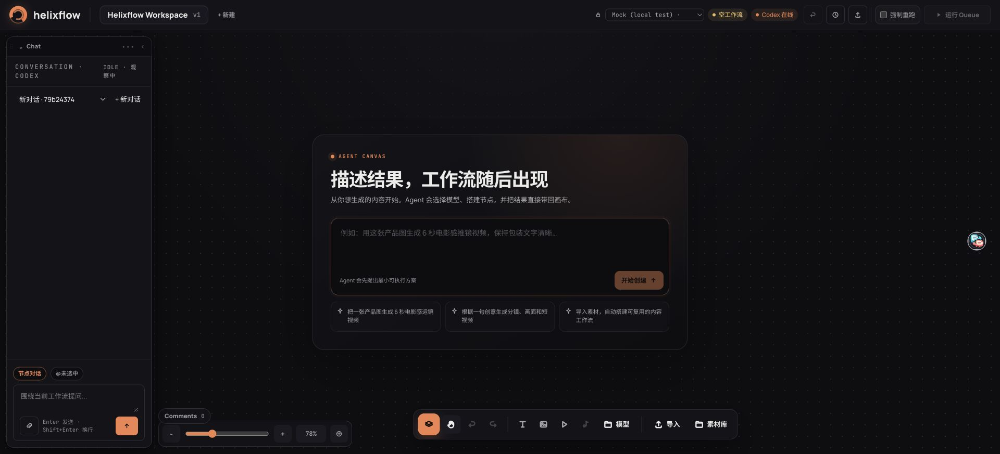

**判断**：视觉 onboarding 合格，行为 onboarding 不合格。产品在同一页暴露了两个“可以对 Agent 说话”的入口，却没有让它们拥有稳定、可预测的语义。

### 3.2 从中央 Agent Canvas 发起创作

输入：

> 生成一张赛博朋克城市海报：先写中文提示词，再生成一张 16:9 图片。

**用户预期**：点击“开始创建”后，Agent 至少生成一个最小工作流，或在画布上出现可确认的草案。

**实际结果**：约 37 秒后，系统返回了一段中文提示词，并说“当前为 Chat 模式，无法直接生成图片。请切换到 Create Workflow”。

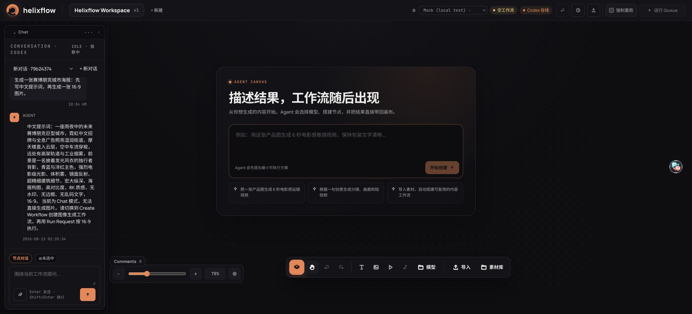

**代码证据**：

- 空画布文案在 `web/src/components/graph-canvas-overlays.tsx:40-54` 承诺“工作流随后出现”和“开始创建”。
- 但 `web/src/app.tsx:356-359` 只是把原始文本交给通用 `sendMessage`，没有把这个入口固定为 `CreateWorkflow`。
- 后端 `crates/server/src/workbench_message.rs:79` 仍用文本关键词分类；这条自然语言未包含字面上的“创建 workflow”，因此落入 ambiguous Chat fallback。

**严重性：P0 / 发布阻断**

**建议**：中央 Agent Canvas 输入必须显式携带 `mode=create_workflow` 或 `intent=create_canvas`，不能再依赖关键词猜测。左侧 Chat 才保留自动分类。按钮文案、接口参数、后端 turn metadata 必须是同一份真相。

### 3.3 显式要求创建工作流

输入中加入“创建一个 workflow”后，系统约 53 秒进入正确模式，但返回：

```text
需要澄清 [BINDING_UNAVAILABLE]
ask the user to pick a specific model or enable a connector
缺失：s1.model
```

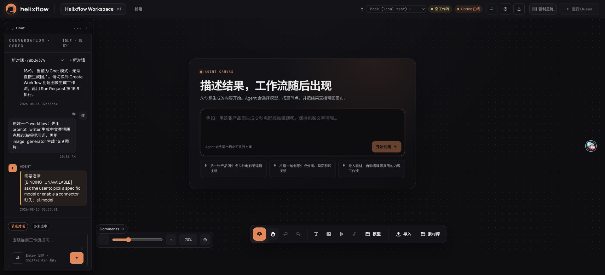

**问题**

- 中文 UI 混入内部错误码和英文运行时指令。
- 没有“选择可用模型”“启用连接器”“改用 Mock”按钮。
- 当前明明选中 Mock runtime，但模型目录仍以 Atlas 模型为主要选择；点击不可用模型卡片也没有形成可见动作。
- 这不是用户缺少信息，而是产品没有把运行环境、模型目录、绑定编译器统一成一个可解释的状态。

**严重性：P0（状态真相）/ P1（错误呈现）**

**建议**：

1. 模型目录默认只展示当前环境可运行项；不可用项放入“未连接”分组。
2. Clarify 卡片提供结构化 CTA，不展示内部 `s1.model`。
3. 如果 Mock 是正式本地测试路径，catalog resolution 和运行 inspector 必须把它作为显式实现；如果不是，则运行按钮也不应让同一图成功。

### 3.4 手动添加节点

从节点库依次添加 Prompt Writer、Generate Image 后，两个节点被放到完全相同的位置；后加节点把先加节点彻底覆盖。随后加入 Text Input 时再次复现。

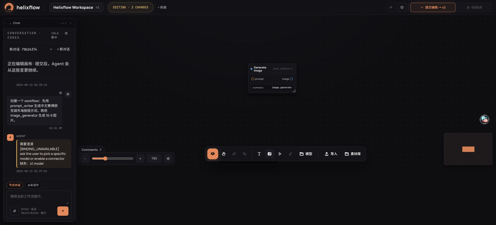

**代码证据**：`web/src/components/graph-canvas-edit-actions.ts:30-50` 对每个新节点都使用同一个 `viewportCenterWorld()`，没有碰撞检测或级联偏移。

**严重性：P1**

**建议**：先从视口中心开始做 24–40 px cascade，再运行基于 node bounds 的 occupancy search；添加成功后自动选中新节点并轻微居中。

节点拖动、端口连线和连线反馈本身表现清晰；这部分是当前交互中完成度较好的区域。

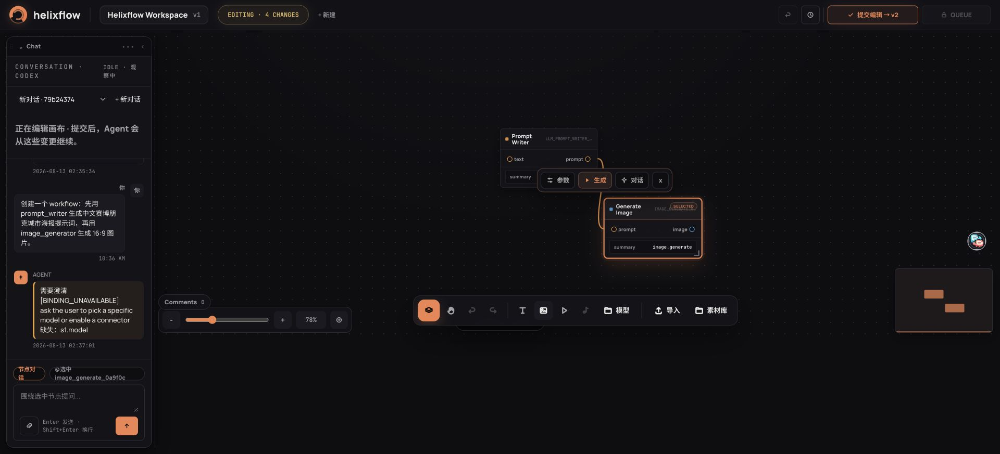

### 3.5 参数编辑

选中节点后会出现紧凑的浮动工具条，结构上是合理的。但实测：

- 鼠标点击“参数”时，节点选中态会被清掉，浮动工具条随即消失。
- 用键盘 Tab 聚焦后按 Enter，参数面板可以正常打开。

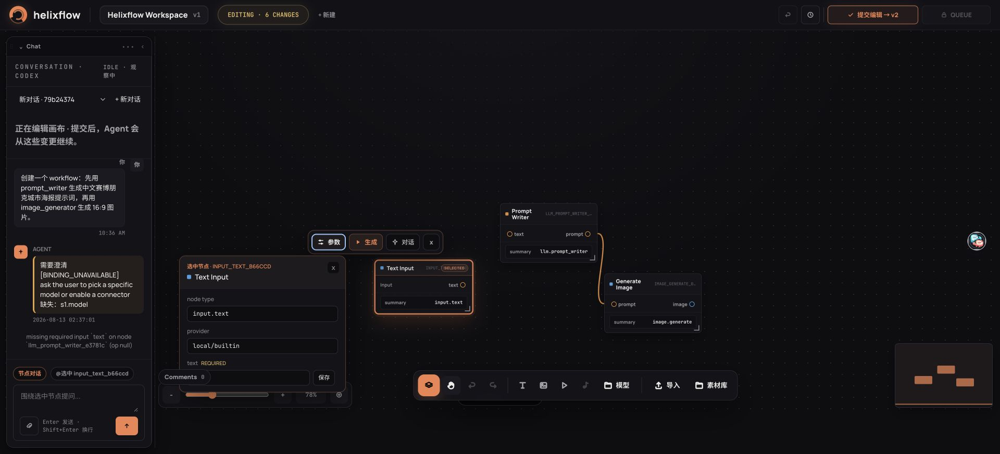

`graph-canvas-inspector.tsx:156-169` 虽然在外层 `onClick` 中调用 `stopPropagation()`，但真实 pointer/canvas selection 顺序仍让 summary 的鼠标路径失效，现有单元测试没有覆盖这条浏览器交互。

**严重性：P0 / 发布阻断**

**建议**：在 `summary` 上处理 `onPointerDown` 与 `onClick`，阻止画布 deselect；增加浏览器级测试，断言鼠标点击后 details 保持 open 且 selection 不变。

另外，每个字段都需要一个很小的“保存”动作。下拉选项看起来已经切换，但若未再点击保存，提交/重开后会恢复旧值。应改为明确的 dirty indicator + 整个面板统一应用，或字段变更即写入 edit session 并提供撤销。

### 3.6 提交与运行

最初只放 Prompt Writer 和 Generate Image 时，提交返回原始错误：

```text
missing required input 'text' on node ... (op null)
```

错误没有高亮出错节点，也没有提供“添加 Text Input 并连接”的修复动作。补齐 Text Input、连接和参数后，提交到 v2 成功。

Mock 运行随后成功，3 个节点均生成产物，运行状态与节点状态能同步更新，说明核心 happy path 是存在的。

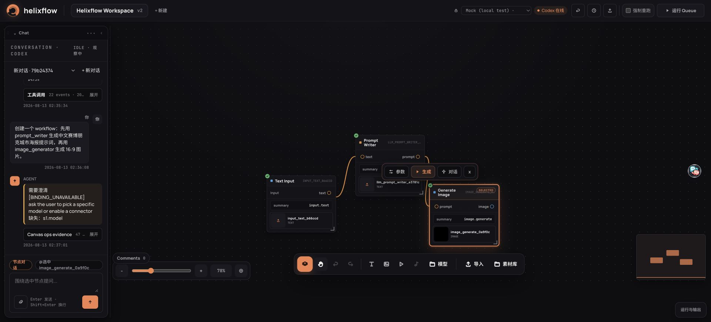

这里有一处状态矛盾：Generate Image 的实现检查器仍表达“连接器/实现不可用”，但相同图通过 Mock 成功执行。用户无法判断到底应该相信检查器还是 Run 结果。

**建议**：把 graph readiness 做成服务端唯一派生状态，并由检查器、Run 按钮、Agent binder、错误卡共同消费；不要在 UI 各自推断。

### 3.7 运行输出与 Artifact Viewer

优点：

- 运行完成后会出现底部“运行与输出”入口。
- 底部面板可以拖动改变高度，画布几何位置基本保持稳定。
- 产物可在右侧 Viewer 查看元数据和内容，并能“接受”结果。
- 文本产物现在会加载真实文件内容，而不只是元数据。

问题：

- 输出面板默认高度太低，文本和动作被裁切，用户需要先发现并拖动 separator。
- Chat 展开时，输出选择/Viewer 的发现路径更弱；收起 Chat 后才明显。
- Mock 图片是 1×1 黑图，作为本地 provider 可以理解，但 Viewer 大量留白，也缺少明显的下载/全屏动作。

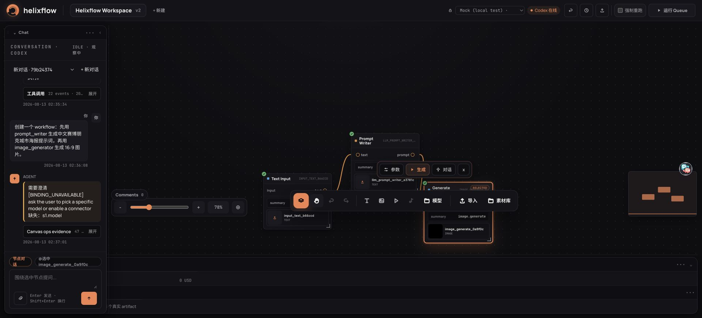

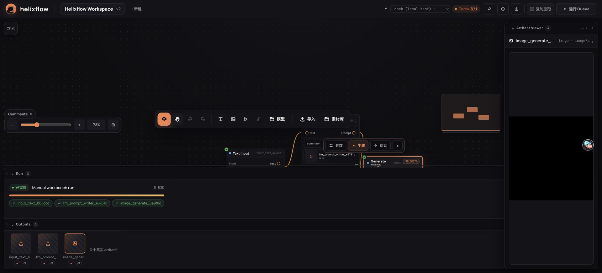

**严重性：P1**

**建议**：首次运行完成时自动把输出面板打开到至少 240–300 px，并聚焦最新产物；Viewer 增加下载、全屏、在 Finder 中定位（本地版）和清晰的内容类型空状态。

### 3.8 历史、版本和会话

历史抽屉包含会话、迁移检查、版本和运行记录，恢复按钮也可见，信息完整度高。

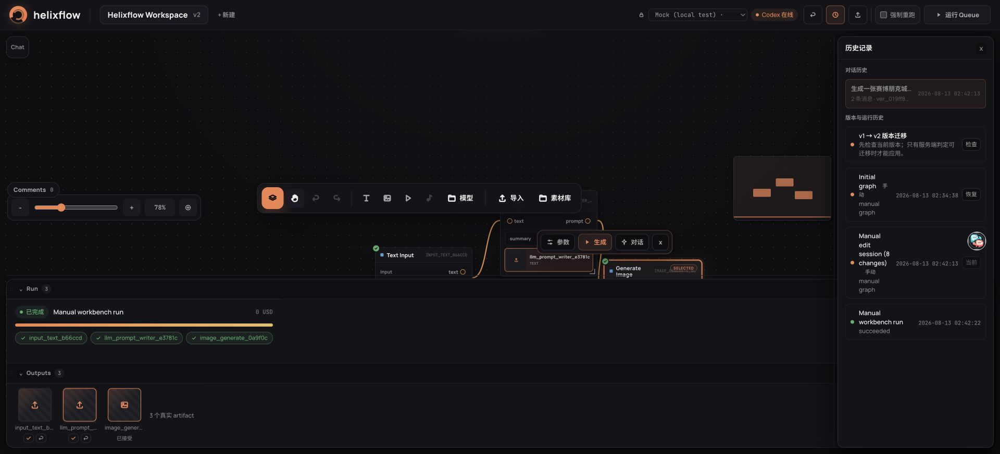

但连续创建新会话时，标题均为 `新对话 · <短 ID>`。代码 `web/src/store.ts:293-299` 固定以“新对话”创建，没有从第一条消息生成可区分标题。

更严重的是第二会话实测：

1. 新建会话。
2. 输入“这个工作流有几个节点？请只回答节点数量。”
3. UI 显示泛化的 busy 状态。
4. 约 6 分 35 秒后 Agent 目录已经写出 `{"message":"无法确定"}`。
5. UI 回到空闲，却只保留用户消息，没有 Agent 回复，也没有错误。
6. SQLite 中该 `agent_turns` 行仍是 `status=running`，`completed_at`、`codex_turn_id`、`execution_id` 均为空；会话 `codex_thread_id` 也为空。

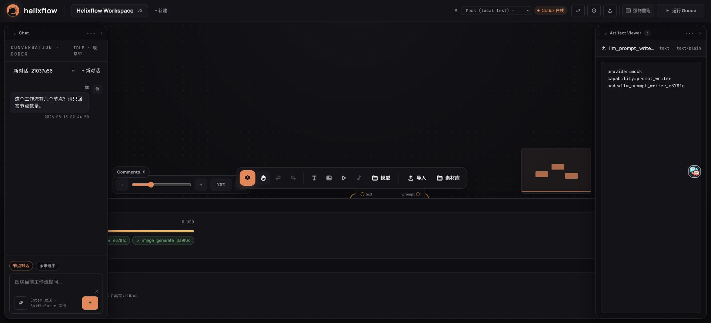

**严重性：P0 / 发布阻断**

**建议**：

- 将 agent process 退出、out contract 写入、消息持久化和 turn terminalization 做成同一个可恢复状态机。
- 前端收到连接结束但没有 terminal message 时，必须显示“回复未完成/可重试”，不能静默回 idle。
- recovery worker 应扫描 `running + reply.json exists` 并补偿完成，或明确标记 failed。
- 以第一条用户消息自动生成会话标题；允许就地重命名。

### 3.9 运行中反馈

两个 Agent 请求分别约耗时 37 秒和 53 秒，第二会话更长。主要可见信息只有“请求处理中”“Agent 正在执行工具调用”和技术性事件数量。

**问题**：

- 没有阶段化解释：理解需求、选择模型、构建图、验证、等待 provider。
- 没有预计等待范围、最后活动时间和明确取消动作。
- 日志中混有 `ctx.created`、`turn.sent`、`Canvas ops evidence` 等开发者术语。

**严重性：P1**

**建议**：默认只展示 3–5 个用户语义阶段；原始事件放入“开发者日志”。超过 15 秒显示最后活动时间，超过阈值提供重试/中断。

### 3.10 窄屏与手机

在 `900×900` 时，左右面板收为 Chat/Viewer 轨道，顶部控件换成两行；基本可操作。但画布沿用桌面保存的 pan/zoom，节点落到视口以外，页面没有自动 fit。

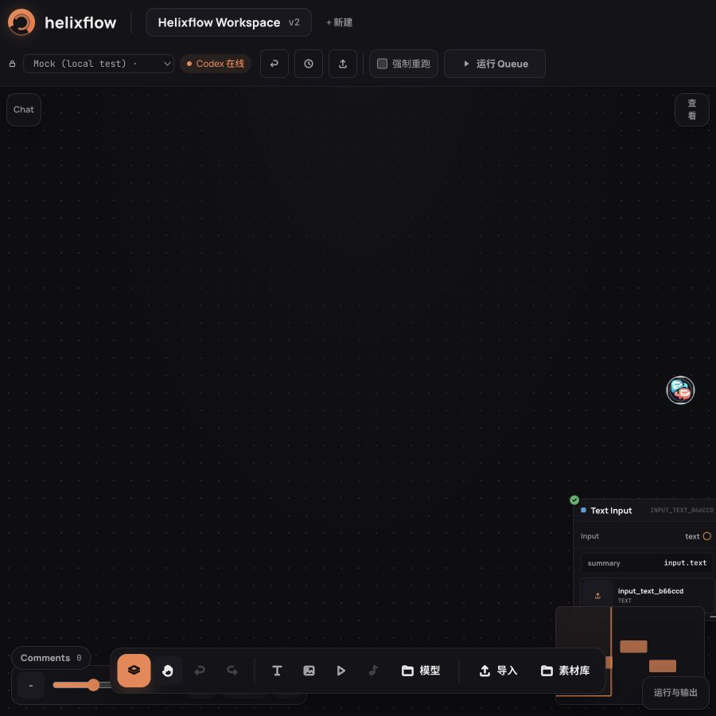

在 `390×844` 时：

- 顶部动作拥挤且换行；底部工具条横向裁切。
- 画布大部分为空，实际节点在右下方/视口外。
- Chat 抽屉占据大部分宽度；Viewer 打开后仅剩约 80 px 画布。
- Chat 和 Viewer 能互斥打开，这一点是正确的。

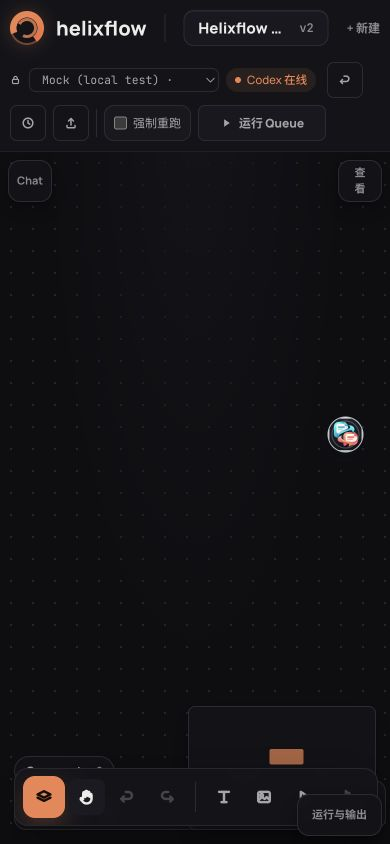

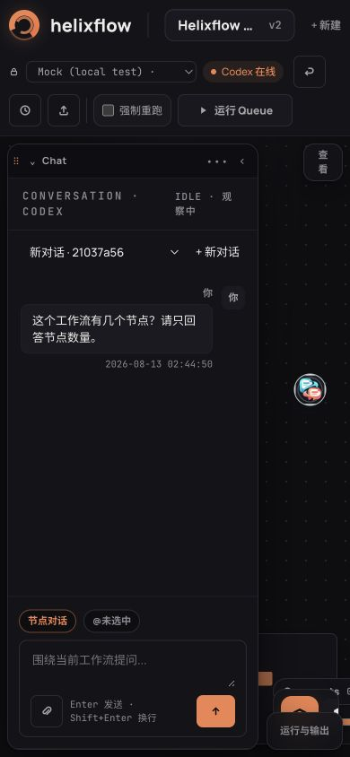

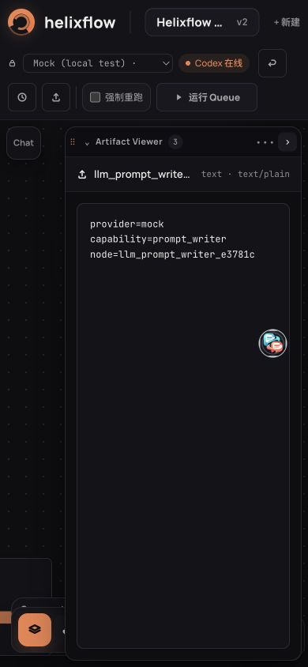

**严重性：P1**

**建议**：移动端进入工作区、切换版本或关闭抽屉后自动 `fit selection/all`；把底部工具条变成可横滑或二级菜单；在小于 600 px 时将 Chat/Viewer 视为全屏 sheet，而不是保留一条不可用的画布缝隙。

## 4. 与成熟产品的对比

对比使用公开、官方的交互说明，不比较模型质量或付费能力：

- [VS Code Custom Layout](https://code.visualstudio.com/docs/configure/custom-layout)：稳定区域、面板移动/重置、可发现的布局控制。
- [TapNow Explore the Canvas](https://docs.tapnow.ai/en/docs/canvas/explore-the-canvas)：以画布和内容节点作为主结果面，提供 fit/minimap 等导航心智。
- [TapNow Agent](https://docs.tapnow.ai/en/docs/agent/tapnow-agent)：Agent 读取画布上下文并围绕选中内容工作。
- [TapNow Generate and Edit Images](https://docs.tapnow.ai/en/docs/canvas/generate-and-edit-images)：生成结果直接成为可继续操作的画布内容。
- [Higgsfield Canvas Intro](https://higgsfield.ai/canvas-intro)：以拖拽、连接、生成作为单一连续流程。

| 交互原则 | 成熟产品常见做法 | Helixflow 当前 | 差距 |
|---|---|---|---|
| 稳定区域 | 区域可移动/折叠，且能恢复默认布局 | Chat、Canvas、Viewer、Output 已分区且可 resize | 缺少醒目的 reset layout / reset view；底部输出初始高度不佳 |
| 入口语义 | 一个入口对应一个稳定动作 | Chat 与 Agent Canvas 都进入通用文本分类 | 中央“开始创建”仍可能进入 Chat，属于语义违约 |
| 内容在画布上 | 新结果直接可见并可继续组合 | 节点在画布，产物主要在 Output/Viewer | 结果与生成节点之间的视觉联系偏弱 |
| 新对象布局 | 新节点避免重叠并进入可见区域 | 所有新节点落在同一中心点 | 连续添加立刻覆盖 |
| 上下文 Agent | 选中节点后 Agent 操作范围明确 | 有选中节点工具条和 proposal 动作 | 参数鼠标路径失效；模式、provider 状态不够可信 |
| 导航 | fit all/fit selection 是一等动作 | 有缩放和 minimap | 窄屏/恢复后不会自动把工作内容带回视口 |
| 错误恢复 | 错误是用户语言，并给出下一步 | 暴露内部 code、字段和英语指令 | 缺少可执行 CTA 与自动修复 |
| 长任务 | 阶段、取消、重试、最后活动时间 | 通用 busy + 技术日志 | 等待期间信心不足，静默终态尤其危险 |

Helixflow 最接近成熟产品的地方是“工作台区域架构”和“节点 + 版本 + 运行产物”的整体骨架；最远的地方不是视觉，而是**入口承诺、状态真相和失败终态**。

## 5. 优先级清单

### P0：发布前必须解决

| ID | 问题 | 验收标准 |
|---|---|---|
| UX-P0-01 | Agent Canvas “开始创建”可能被归类为 Chat | 该入口 100% 进入 create workflow；浏览器 E2E 覆盖普通自然语言 |
| UX-P0-02 | 参数按钮鼠标路径导致 selection 丢失 | 鼠标/触控/键盘均能打开并保持选中态 |
| UX-P0-03 | 新会话产物存在但回复未持久化、turn 永久 running | 所有进程退出都有 succeeded/clarify/failed/cancelled 之一；前端绝不静默 |
| UX-P0-04 | provider/catalog/inspector/run 可运行性互相矛盾 | 所有表面消费同一个 server-derived readiness，文案与实际运行一致 |

### P1：高价值优化

| ID | 问题 | 建议 |
|---|---|---|
| UX-P1-01 | 新节点完全重叠 | cascade + collision avoidance + 自动选中 |
| UX-P1-02 | 运行中反馈泛化 | 用户语义阶段、最后活动时间、中断/重试 |
| UX-P1-03 | 内部错误暴露 | 结构化错误卡 + 模型/连接器/修复 CTA |
| UX-P1-04 | 参数保存心智不清 | 即时写 edit session，或统一 Apply + dirty 状态 |
| UX-P1-05 | Output 默认过矮、Viewer 难发现 | 首次完成自动展开并聚焦最新产物 |
| UX-P1-06 | 会话标题完全同名 | 第一条消息自动命名，可手动改名 |
| UX-P1-07 | 窄屏工作内容离屏 | 状态切换后 fit；移动端全屏 sheet |
| UX-P1-08 | 小字号和低对比技术信息偏多 | 正文至少 12–13 px；技术 metadata 下沉 |

### P2：打磨项

- 增加 `Fit all`、`Fit selection`、`Reset view`、`Reset layout` 的可见入口和快捷键提示。
- 清晰区分 Chat、Create、Modify、Run，显示当前模式而不是让用户猜。
- 节点验证错误直接落到节点卡和对应端口。
- Viewer 增加下载、全屏、定位和复制路径等动作。
- 将事件日志中中英文和内部标识统一放到开发者模式。
- 做一次 VoiceOver/屏幕阅读器和真实触屏专项审计；本次只验证了 DOM 语义与部分键盘路径。

## 6. “check out / 工作区改动”应该提交还是丢弃

### 6.1 本地 26 个 commit：必须保留，不应丢弃

当前 `main` 相对 `origin/main` ahead 26，而且逐个核验后，这 26 个 commit **没有出现在任何远端分支**。它们不是缓存或构建产物，而是一整套真实产品工作：durable conversations、Agent interrupt/resume、canvas tools、Atlas/Seedance、artifact dock、canvas-first workbench、agent-first onboarding 等。

结论：

- **保留并先建立安全分支/远端备份。**
- 不要直接在当前 dirty `main` 上 pull 或 rebase。
- 远端 main 还有 3 个依赖更新 commit；应先保存未提交源码，再在专用分支上 rebase `origin/main`。
- 26 个 commit 涉及多个产品 tranche，不建议压成一个超大 PR；应按 conversation/runtime、canvas agent、provider/catalog、workbench UI 分组审查和发布。

### 6.2 未提交的源码：大部分应该提交，但需拆分

当前共有 14 个未提交源码文件（9 modified + 5 untracked）；除字体这一处视觉改动外，其余 13 个文件构成一套相对连贯的多人 presence/performance 修复：

- 远端 presence 去除自己和 legacy echo
- actor TTL、heartbeat
- 80 ms 异步 coalescing
- canvas rect 缓存、`transform3d` cursor
- presence 渲染隔离与性能测试
- background/store 测试

验证结果：前端 32 个测试文件、242 个测试通过，production build 通过；`git diff --check` 通过。

结论：**这组源码不应丢弃，建议独立提交为 collaboration/presence performance PR。**

例外：`web/src/styles.css` 把主字体从 Space Grotesk 改为 Manrope。它不属于 presence 性能修复，且会改变产品视觉气质。建议单独做视觉确认；若没有明确设计意图，就从该 PR 排除或丢弃这 1 行。

### 6.3 审计/运行产物：不应混入产品 PR

| 路径 | 内容 | 建议 |
|---|---|---|
| `.stack/` | 旧 agent checkpoint、issue/PR 证据和 runtime 状态 | 不提交；先归档到 repo 外，再从工作区移除/忽略 |
| `.audit/findings.json` | 旧审计 finding | 不提交；若结论仍有价值，合并进正式 docs 后删除原产物 |
| `artifacts/triage/` | #114/#115 等 issue draft/evidence | 不提交；相关事项已进入 GitHub 后归档/删除 |
| `audit-report-2026-07-15.md` | 旧审计报告 | 不与产品代码一起提交；可移入统一 `docs/audits/`，否则外部归档 |

这些文件合计不大，但属于流程证据，不属于运行时源码。当前没有替用户删除，是为了避免误删仍需追溯的历史。

### 6.4 推荐的安全处理顺序

1. 从当前 HEAD 创建安全分支，确保 26 个 local-only commit 有名字可追溯。
2. 将未提交 presence/performance 源码提交到独立分支；排除审计目录和待确认字体变更。
3. 拉取并 rebase 远端 3 个依赖更新，跑完整前后端验证。
4. 按产品 tranche 拆 PR；不要把 26 commits、presence 修复和旧审计产物塞进同一个 PR。
5. 旧 `.stack/.audit/artifacts` 先压缩归档到 repo 外，再添加明确 ignore 规则并清理工作区。

## 7. GitHub 当前实时状态

截至 2026-08-13 实时查询：

- Open issues：**2 个**，并不是 0。
  - [#143 GH130 后续 umbrella：v1 迁移、capability/schema 收敛与 legacy 删除](https://github.com/majiayu000/helixflow/issues/143)
  - [#146 GH143 子任务：两个 release 后删除 legacy proposal 契约与回滚开关](https://github.com/majiayu000/helixflow/issues/146)
- Open PRs：**0 个**。

#146 的“两次 release”时间条件看起来已经满足：PR #142 在 2026-07-26 14:15 UTC 合并，`v0.1.0` 在当天 18:48 UTC 发布，`v0.2.0` 在 2026-07-30 19:33 UTC 发布。但 issue 仍缺迁移完成度、稳定性阈值/观测数据和替代回滚机制，不能仅凭两个 tag 自动关闭。合理下一步是补齐证据并重新 triage #146；完成后再关闭 umbrella #143。

## 8. 验证结果

| 检查 | 结果 |
|---|---|
| `cd web && npm test` | **通过：32 files / 242 tests** |
| `cd web && npm run build` | **通过** |
| `cargo test -p helixflow-server workbench_message` | **通过：26 passed** |
| `git diff --check` | **通过** |
| 浏览器 console | 未见 helixflow origin 的产品错误；只有浏览器扩展警告 |
| Mock 手动图运行 | **通过**，3 节点和产物完成 |
| 第二会话终态 | **失败**，reply 文件存在但 UI/DB 未完成 |
| 上传 UI | **Blocked - Env**：文件选择自动化超时，不能据此判定产品失败 |
| Atlas/FAL 真实生成 | **未执行**：本次没有授权付费 provider 调用 |
| 屏幕阅读器专项 | **未执行** |

旧的 canonical tracker `docs/user_story_qa_20260630.csv` 最后反映的是 2026-07-16 左右的状态，不能代表本次实测。按照表格工作流，本应更新同一 tracker 而不是创建第二份；但当前环境缺少必需的 `@oai/artifact-tool`，因此本次没有用普通文本脚本绕过约束去覆盖 CSV。本文是当前审计结果，CSV 更新属于明确的环境阻塞项。

## 9. 截图索引

完整目录共有 31 张截图：

1. `01-first-entry.png` — 全新工作区首屏
2. `02-agent-creating.png` — 中央 Agent 请求中
3. `03-agent-created.png` — 错误落入 Chat
4. `04-explicit-create-loading.png` — 显式 Create 请求中
5. `05-workflow-created.png` — binding clarify
6. `06-model-catalog.png` — 模型目录
7. `07-model-added.png` — 点击模型后的状态
8. `08-manual-nodes.png` — 新节点完全重叠
9. `09-node-dragged.png` — 节点拖动
10. `10-nodes-connected.png` — 连线成功
11. `11-workflow-committed.png` — 首次提交错误
12. `12-node-library.png` — 节点库
13. `13-text-parameter.png` — 参数入口
14. `14-parameter-keyboard-open.png` — 键盘打开参数
15. `15-commit-complete.png` — v2 提交完成
16. `16-run-queued.png` — 运行排队
17. `17-run-output-panel.png` — 默认过矮的输出面板
18. `18-output-selected.png` — 输出选择
19. `19-panel-resized.png` — 调高输出面板
20. `20-output-after-chat-collapse.png` — 收起 Chat 后的输出区
21. `21-artifact-preview.png` — 图片产物 Viewer
22. `22-output-accepted.png` — 接受产物
23. `23-text-artifact-preview.png` — 文本产物内容
24. `24-history.png` — 历史/版本/运行
25. `25-new-conversation.png` — 两个同名会话
26. `26-chat-loading.png` — 第二会话请求中
27. `27-chat-complete.png` — 静默无回复终态
28. `28-compact-900.png` — 900 px 窄屏
29. `29-mobile-390.png` — 390 px 手机画布
30. `30-mobile-chat.png` — 手机 Chat 抽屉
31. `31-mobile-viewer.png` — 手机 Viewer 抽屉

## 10. 最终判断

Helixflow 的“功能数量”和“系统骨架”已经很丰富，视觉方向也比普通内部工具成熟；但产品还没有达到“完美”。当前最需要的不是继续加更多功能，而是把已有功能的四件事做到可信：

1. 用户点的入口必须对应稳定模式。
2. UI 显示的 provider/readiness 必须和真实运行一致。
3. 每个长任务必须有可理解的阶段和必达终态。
4. 每个关键编辑动作必须同时支持鼠标、键盘和窄屏。

先解决 P0，再做 P1，Helixflow 才适合从“工程 Beta”进入“面向真实创作者的产品 Beta”。
